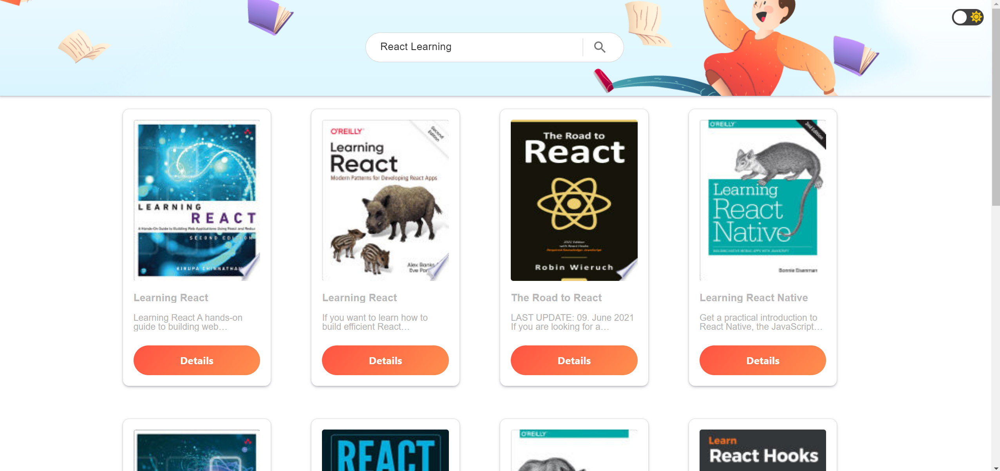
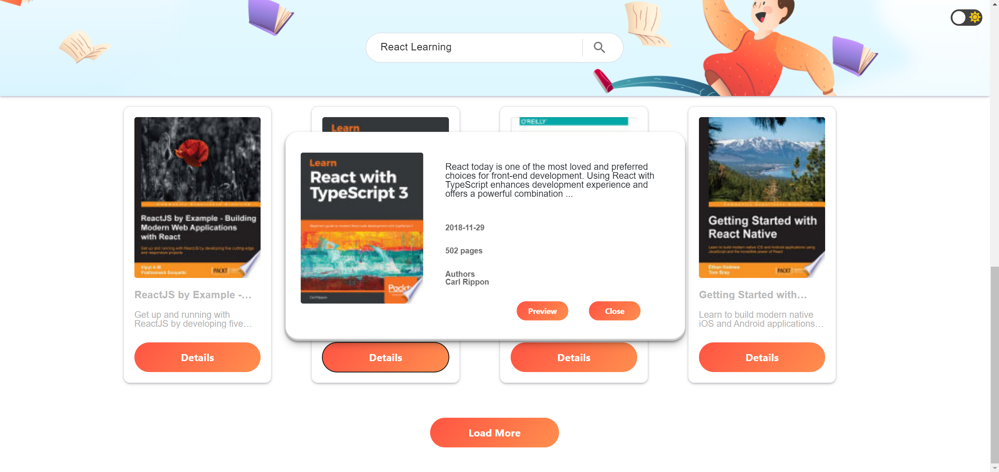

# 🧐Book Searching

🌍 **Canlı URL** 

## [README]
## Genel Bakış
- [Proje Hakkında](#proje-hakkinda)
- [Proje İçeriği](#proje-icerigi)
- - [Kullanılan Teknolojiler](#kullanilan-teknolojiler)
- - [Ekran Görüntüleri](#ekran-goruntuleri)
- [Kullanılan Kaynaklar](#kullanilan-kaynaklar)
- [Katkıda Bulunanlar](#katkida-bulunanlar)

## README 
## ℹ Proje Hakkında <a name="proje-hakkinda">

[İSMEK](https://enstitu.ibb.istanbul/portal/default.aspx), Zemin İstanbul, [Kodluyoruz](https://www.kodluyoruz.org/), [Patika.dev](https://www.patika.dev/) ve [Microsoft](https://www.microsoft.com/tr-tr) iş birliği ile gerçekleştirilen "Front-End Developer Eğitim Programı" için bitirme projesi olarak **Book Searching** adlı bir kitap arama uygulaması geliştirdik.

Geliştirmiş olduğumuz uygulama ile kullanıcı kitap veya yazar ismi yazarak istediği kitabı arayabilecektir. Girilen sözcüğe uygun kitaplar listelenirken, bu kitaplara ait kısa bilgiler modal ile birlikte kullanıcıya sunulmaktadır. Kullanıcı, dilerse bu kitabın tüm detaylarına "preview" butonuna tıklayarak kolayca erişebilmektir.
 

## 📝 Proje İçeriği <a name="proje-icerigi">

###  Kullanılan Teknolojiler <a name="kullanilan-teknolojiler">

 

### 📸 Ekran Görüntüleri <a name="ekran-goruntuleri">

**Masaüstü ekran görüntüleri**

## 📚 Kullanılan Kaynaklar <a name="kullanilan-kaynaklar">

Uygulama içerisindeki kitapların bilgileri <a href="https://developers.google.com/books/docs/overview" target="_blank">Google Books API</a> ile sağlanmıştır.

## ✍ Katkıda Bulunanlar <a name="katkida-bulunanlar">

**Samet KOYUNCU**

**Onur AYLANÇ**

**Nurselin ÇAVDAR**
  

Eğer proje hakkında bir öneriniz varsa veya herhangi bir sorun fark ettiyseniz lütfen bizimle iletişime geçiniz.

---
